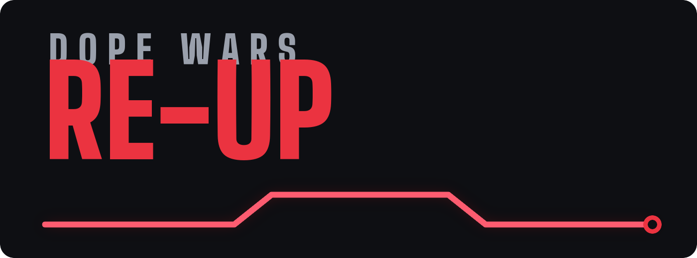
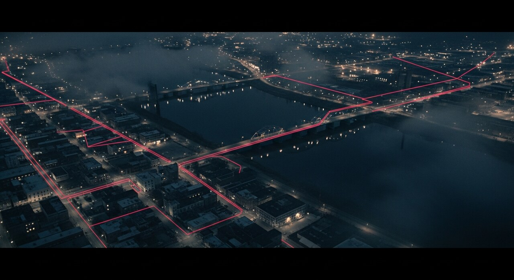
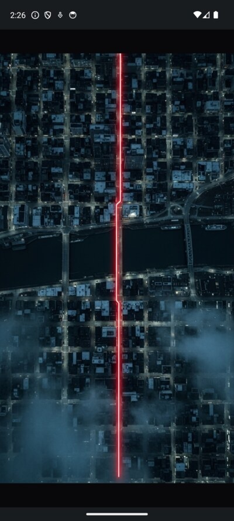
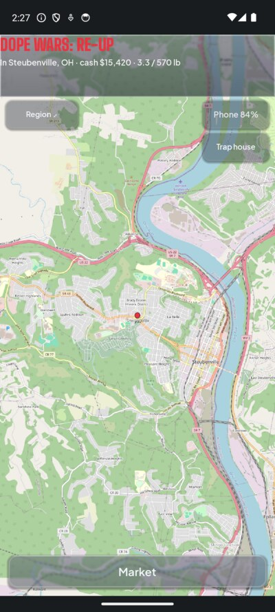
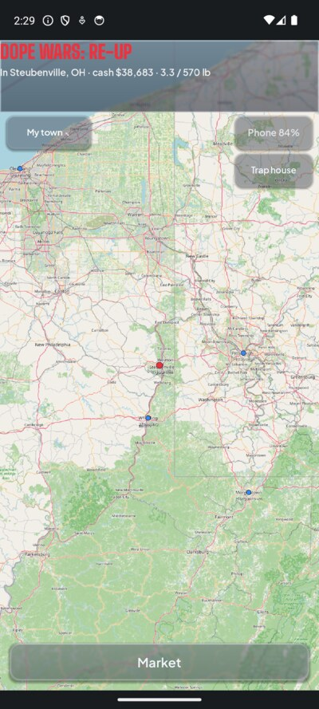
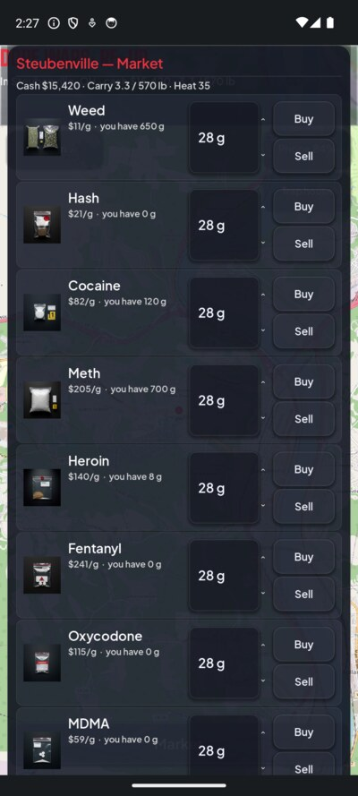
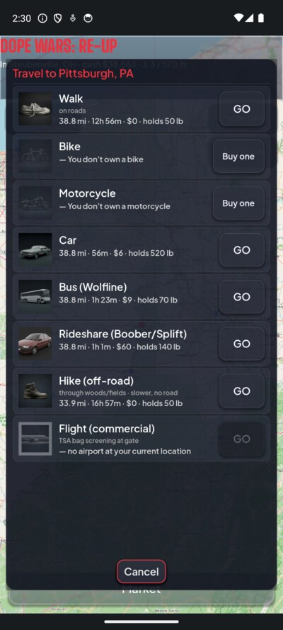
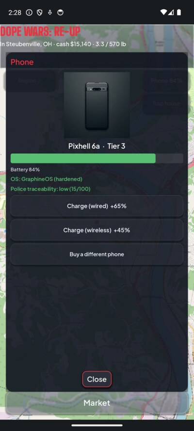
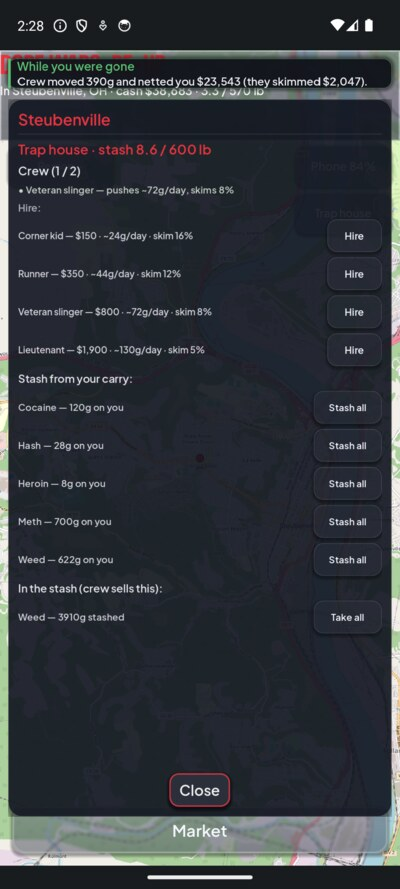

<div align="center">



<br><br>



<br>


**Buy low, sell high, stay off the radar. On the real map, in real towns, with real prices.**
Start broke in a rust-belt river town. Learn the block before the block learns you.

</div>

---

## ▚ The pitch

You are a small operator in a real American city, rendered from actual OpenStreetMap data. Prices
move by region and demand. Product has weight and takes up space. Cops run on dice and heat, not
scripted cutscenes. The world keeps turning when you close the app: your crew keeps pushing, your
phone keeps draining, rivals keep moving.

It is modeled on real data (DEA and NIDA pricing, FBI and CDC regional stats) and framed to educate,
not glamorize. Nobody is shown using. The tone is The Wire, not GTA.

---

## ▚ The streets

<table>
<tr>
<td width="25%"><br><b>Plot your block</b><br>Animated boot on real map art.</td>
<td width="25%"><br><b>Town level</b><br>Real streets, your operations.</td>
<td width="25%"><br><b>Region level</b><br>Plot trips between cities.</td>
<td width="25%"><br><b>The market</b><br>Server-set prices, art that scales with weight.</td>
</tr>
<tr>
<td width="25%"><br><b>Plot a trip</b><br>Real OSRM routes, per-vehicle carry limits.</td>
<td width="25%"><br><b>Your phone is exposure</b><br>Flash GraphineOS, go dark.</td>
<td width="25%"><br><b>Trap houses</b><br>A crew that pushes while you sleep.</td>
<td width="25%" valign="top"><br><br><b>and a whole lot more</b><br>vehicles, cosmetics, crews, and a live backend.</td>
</tr>
</table>

---

## ▚ Systems online

### The map, at two zooms
Real OpenStreetMap tiles. Settled in a town you see the streets and your operations. Tap **Region**
to zoom out to the cities and plot travel. Trips auto-zoom to the route; arriving drops you back on
your block.

### The market
Every drug has a real baseline price (dollars per gram) that drifts by region, demand, and a
server-set volatility window. You never send a price; the server sets it, so it can't be forged. The
product art changes with how much you hold: a baggie at personal weight, a jar at an ounce, a taped
brick at a kilo. Weed in bulk does not look like meth in bulk.

### Logistics: carry, wheels, trap houses
Inventory is not free to move. Weight and volume are real. Walk and you carry little; buy a used car
and the trunk holds a lot; a bus or a plane exposes you to a search. Overweight for your ride and the
game makes you sell down, take a bigger vehicle, or delegate. Set up a **trap house**, hire a **crew**
(RPG units with a push rate, a skim, and heat they draw), and they sell your stash while you are gone.
Come back to a "while you were gone" report.

### The phone
Phones are gear with a tier, a battery, damage, and an OS. A cash burner is anonymous but dumb. A
stock flagship is capable but tracked. Flash **GraphineOS** on a supported model and police
traceability drops from high to low. Wired charging is fast; wireless is the convenience trade. The
phone is also the frame: a cracked screen degrades the display and drains faster.

### Cosmetics and cred
Flair only, and never for sale with real money. **Cred** is an earned currency you spend on 100
cosmetic items: emblems, titles, callsign nameplates, badges. Supporter tiers and admin awards grant
the exclusive ones. Real money buys playtime access, never an advantage.

### Multiplayer (in progress)
Opted-in players share the map. You do not see each other from proximity alone. Awareness triggers
when someone does something criminal in front of you, or your perception check catches a subtle tell.
Talking out loud is heard within earshot; a whisper is quieter but may still be noticed; a phone call
is private from players but interceptable by police unless your OS is hardened.

---

## ▚ Progression

What is built, and what is still locked.

| System | Status |
|---|---|
| Real-map travel, OSRM routing, town/region zoom | ✅ live |
| Server-priced market, per-weight product art | ✅ live |
| Vehicles, per-mode carry limits, buy-in-game | ✅ live |
| Trap houses + RPG crews + passive economy | ✅ live |
| Phones as gear, GraphineOS, traceability | ✅ live |
| d20 skill-check engine (perception, stealth, busts) + stat-driven outcomes | ✅ live |
| Character creation: D&D stats, classes, perks, procedural start | ✅ live |
| Map intel overlays: perception-gated, decaying danger/market/competition reads | ✅ live |
| Cosmetics locker: CRED economy, 100-item catalog, buy/equip (flair only) | ✅ live (art pending) |
| Diegetic phone frame: tier bezel, damage cracks, low-battery pulse + repair | ✅ live |
| Buildings: occupy REAL OSM map locations as operations (Overpass-backed) | ✅ live |
| General aviation: own aircraft, fly yourself, ADS-B ramp-check risk | ✅ live |
| Supabase backend: server-authoritative, RLS, adversarially tested | ✅ live |
| Branded UI: glass, fonts, animated boot | ✅ live |
| In-app auto-update: GitHub release → signed + checksum-verified APK, postpone-or-now modal | ✅ client + release pipeline built |
| Multiplayer backend: crews, presence, earshot/whisper/crew comms | ✅ server built + adversarially tested |
| Wire the client to the live backend (server-authoritative online play) | 🔒 building |
| Multiplayer client UI: crews, chat, whispers, presence, proximity awareness | 🔒 building |
| Human-made art replacing the AI placeholders | 🔒 wanted (see below) |

---

## ▚ Get in

### Flash from your browser (no tools, like Meshtastic)
Plug your phone into a desktop and install straight from Chrome. It uses **WebUSB + WebADB**
([`ya-webadb`](https://github.com/yume-chan/ya-webadb)), the same idea as Meshtastic's web flasher.

1. Phone: **Settings → About → tap Build number 7x**, then enable **USB debugging**.
2. Plug into a desktop Chrome or Edge.
3. Open the installer, click **Connect**, approve the browser and phone prompts.
4. Click **Install**.

The installer lives in `web-installer/` and deploys to Cloudflare Pages.

### Manual sideload
Grab the APK from **Releases** and run `adb install dopewars-reup.apk`. The signed release is about
**35 MB** (arm64, stripped). Verify it is genuine:

```bash
sha256sum -c SHA256SUMS.txt
apksigner verify --print-certs dopewars-reup.apk   # compare the SHA-256 to the published cert
```

---

## ▚ Under the hood

- **Client:** `drugwars-reup/` — Godot 4.6.2, GDScript, GL Compatibility. Android now; desktop and
  Steam to follow from the same code.
- **Backend:** `backend/` — Supabase (Postgres, Auth, Realtime, Edge Functions). Server-authoritative:
  the client sends intents, the server sets prices, cash, and time. Nothing a client says is trusted.
- **Anti-cheat:** every table has row-level security, no table is exposed to the API, only a fixed set
  of functions is callable. An adversarial test suite (`backend/tests/adversarial.sql`) runs 15 attacks
  in a rolled-back transaction; it already caught and killed a real money-printing bug. One shared
  server clock means there is no device clock to roll forward.
- **Time is server time.** The world runs on one authoritative clock, so offline income and battery
  drain can't be gamed.

---

## ▚ The art is AI-generated (placeholder)

All 57 images in the game were made with Google Imagen 4 Ultra
(`imagen-4.0-ultra-generate-001`), using the scripts in `drugwars-reup/tools/`. The 100 cosmetic items
have no art yet. Fonts are licensed typefaces (SIL OFL), not AI. `ASSETS.md` tracks every asset and
its status. The direction is documentary and anti-glorification: product shown as sealed evidence,
worn gear, a desaturated rust-belt tone.

## ▚ Artists wanted

The creator is not an artist. The AI art exists so the game could be built and the vision tested. It
is a placeholder, not the goal. Real, human-made art should replace it. If you draw, paint, model, or
design, help is wanted for the class portraits, drug and gear icons, phone and vehicle art, the 100
cosmetic items, and the app icon and wordmark. Keep the tone documentary and non-glamorizing. Open an
issue with samples or a pull request, update the asset row in `ASSETS.md`, and credited work replaces
the AI version. (Contribution licensing is being finalized; see `LICENSING.md`.)

## ▚ Build from source

The client is a Godot 4.6.2 project in `drugwars-reup/`. The Android native libraries
(`android/build/libs/`, over 100 MB) are not committed; restore them once in the Godot editor under
Project, Install Android Build Template. Then `tools/release.sh <version>` runs the full signed build
and emits the checksums. The backend deploy steps are in `backend/README.md`.

---

<div align="center">

**No ads. No pay-to-win. Ever.** Money buys time, never advantage.

<sub>Fiction. The crisis it draws from is not. Licensing pending, see LICENSING.md.</sub>

</div>
